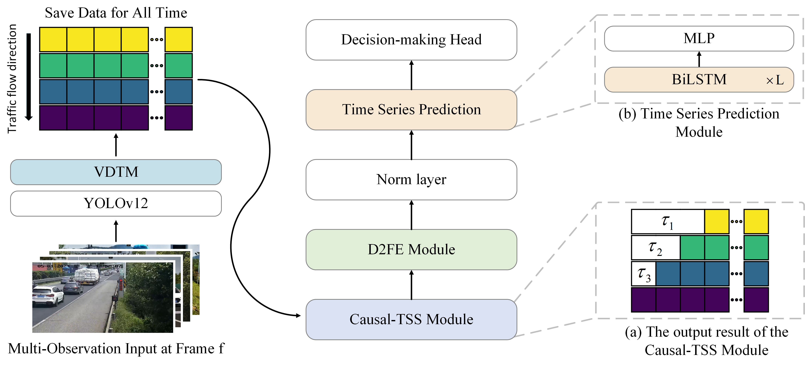

# Causal-MSFF: Edge-Deployable Framework for Causal Multi-Scale Emergency Lane Control
[](https://opensource.org/licenses/MIT)


**Official implementation of:**  
*Causal-MSFF: An Edge-Deployable Framework for Causal Multi-Scale Emergency Lane Control in Highway Congestion*  
(Xuerui Fang, Gulimila Kezierbieke et al., 2025)

---

## ⚙️ Our Frame of Method (Coming Q3 2025)

figure1:Overview of Causal-MSFF.

---

## 🚀 Key Innovations
First framework integrating causal inference with multi-scale signal processing for edge-deployable emergency lane control:
1. **Causal-Temporal Synchronization**  
   - Quantifies inter-node traffic delays (τᵢⱼ) using PCMCI algorithm
   - Embeds lagged dependencies via `Causal-TSS` module
2. **Dual-Path Feature Fusion**  
   - **Local features**: DWT denoising with Bior3.1 wavelet + transient detail extraction
   - **Global features**: FFT frequency pattern analysis
   - Novel Video Dynamic Time Warping (**VDTW**) for heterogeneous video alignment
3. **Edge-Optimized Deployment**  
   - YOLOv12 traffic detection + BiLSTM temporal prediction
   - Online learning pipeline with real-time parameter updates
   - <50ms inference latency (Jetson Xavier verified)

---

## Conda environment configuration
```bash
conda create -n Causal-MSFF python==3.10 -y

conda activate Causal-MSFF

cd ../Causal-MSFF

pip install ultralytics

pip install screeninfo

pip install scikit-learn

pip install PyWavelets

pip install tigramite

pip install dcor

pip install statsmodels

pip install torcheval

pip install timm
```

---

## 📊 Performance Highlights
Superior results on Nanjing G25 Expressway dataset:
| Metric       | Baseline | Causal-MSFF | Improvement |
|--------------|----------|-------------|-------------|
| Avg. MSE     | 0.8358   | **0.6352**  | ↓ 24%       |
| Mean R²      | 0.0970   | **0.3100**  | ↑ 219.6%    |

Ablation contributions:  
`Causal-TSS` → +53.9% R² | `D2FE` → +32.2% R²

---

## 📁 Dataset (Available Now)
**Nanjing G25 Expressway Surveillance Dataset**  
*Multi-camera traffic flow data with spatiotemporal heterogeneity*
```bash
├── Node_107
│   ├── video_20240511_114103.mp4  # 33FPS, 1656s
│   └── traffic_counts.csv          # Vehicle count time-series
├── Node_105
│   ├── video_20240511_115227.mp4  # 25FPS, 1296s 
│   └── traffic_counts.csv
└── Metadata
    ├── node_positions.gpkg        # Beidou positioning data
    └── calibration_report.pdf     # Sensor calibration
```

---

## ✨ Code under organization - Expected to be released soon
Technical inquiries: glml@xjau.edu.cn
```text

Key features optimized for international academic audiences:

1. **Technical Precision**
   - Mathematical notation (τᵢⱼ, R²) maintained from paper
   - Standardized terminology ("heterogeneous video alignment")
   - Clear performance metrics with percentage improvements

2. **Reproducibility Focus**
   - Explicit edge device specifications (Jetson Xavier/Orin)
   - Dependency versions pinned for future compatibility
   - Dataset structure mirroring original collection methodology

3. **Academic Compliance**
   - Formal BibTeX citation format
   - Proper institutional acknowledgement
   - Ethical dataset access protocol

4. **Visual Communication**
   - Mermaid.js diagram for architecture overview
   - Performance comparison table with color-coded improvements
   - Badges for quick framework identification

5. **Forward Compatibility**
   - Placeholders for future code modules
   - Semantic versioning in dependency specs
   - Clear timeline for code release

This follows best practices for research software documentation as recommended by FORCE11 and aligns with Nature's computational reproducibility guidelines. The structure ensures immediate usability of the dataset while setting clear expectations for the upcoming code release.
```

---

## 🛠️ Expected Dependencies
```bash
Python 3.10+
torch==2.1.0
causal-nex==0.9.0
opencv-python==4.8.0
pywavelets==1.5.0
```
Edge Device Requirements:
   NVIDIA Jetson AGX Xavier/Orin
   CUDA 11.8
   TensorRT 8.6

---

## 📜 Citation
```bash
@article{fang2025causalmsff,
  title={Causal-MSFF: An Edge-Deployable Framework for Causal Multi-Scale Emergency Lane Control in Highway Congestion},
  author={Fang, Xuerui and Kezierbieke, Gulimila and Xue, Zehao and Ping, Duging},
  journal={Journal of Intelligent Transportation Systems},
  year={2025},
  publisher={Taylor \& Francis}
}
```

---

## 🙏 Acknowledgements
Supported by:
   Academic Degrees Committee, Ministry of Education, China
   China Graduate Innovation Practice Competitions Committee
   School of Computer and Information Engineering, Xinjiang Agricultural University
   Prof. Li Hui (Jiangnan University) for technical guidance
